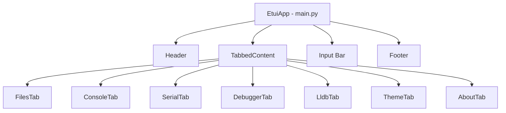
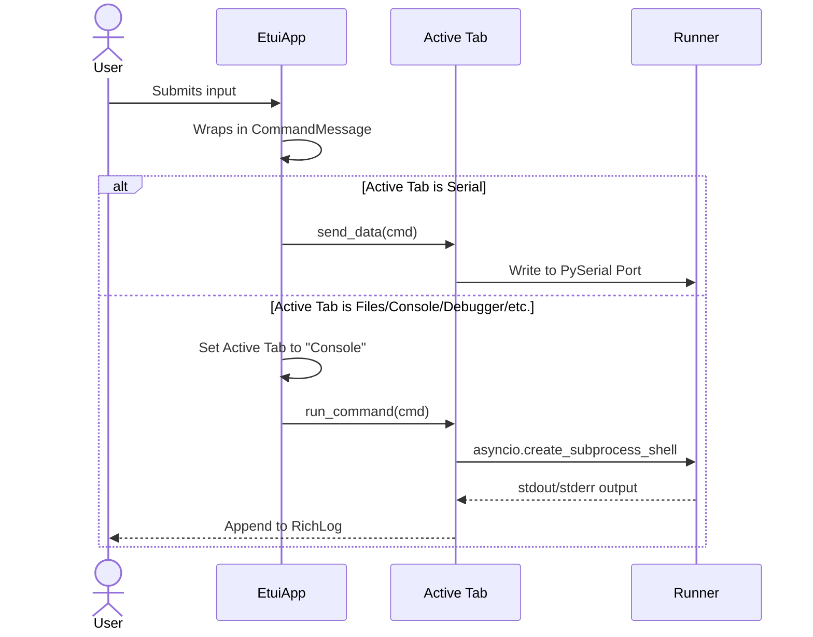
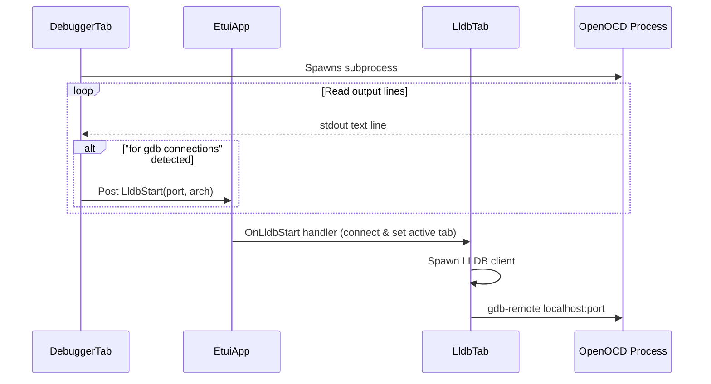

# Embedded TUI (`etui`) Architecture

`etui` is a Textual-based Terminal User Interface (TUI) designed for embedded development, flashing, and debugging on ARM Cortex-M microcontrollers (specifically optimized for Texas Instruments MSPM0 MCUs).

This document outlines the system architecture, component layout, communication flow, and persistence mechanisms of the application.

---

## 1. Component Overview

The application is built using the **Textual** framework, utilizing a tabbed layout to separate concerns.

### Component Breakdown
*   **[main.py](file:///home/pawel/src/32bitmicroLLC/EmbeddedTUI/etui/etui/main.py)** (`EtuiApp`): The root application class. It composes the layout (Header, TabbedContent, Input, Footer) and coordinates events, global styling, and message routing.
*   **[tabs/files.py](file:///home/pawel/src/32bitmicroLLC/EmbeddedTUI/etui/etui/tabs/files.py)** (`FilesTab`): A split panel featuring a `DirectoryTree` on the left and a `FileViewer` on the right. It supports syntax highlighting via `rich.syntax` and filesystem metadata viewing.
*   **[tabs/console.py](file:///home/pawel/src/32bitmicroLLC/EmbeddedTUI/etui/etui/tabs/console.py)** (`ConsoleTab`): A simple local shell console. It runs command-line inputs using Python's asynchronous subprocesses and writes stdout/stderr to a log widget.
*   **[tabs/serial.py](file:///home/pawel/src/32bitmicroLLC/EmbeddedTUI/etui/etui/tabs/serial.py)** (`SerialTab`): A serial communications terminal. It detects ports, connects at standard baud rates, and uses a background thread worker to poll and write incoming bytes to a log.
*   **[tabs/debugger.py](file:///home/pawel/src/32bitmicroLLC/EmbeddedTUI/etui/etui/tabs/debugger.py)** (`DebuggerTab`): Handles hardware debugger processes (like OpenOCD or pyOCD). It enumerates hardware debug probes and targets, spawns debug servers, and captures stdout/stderr.
*   **[tabs/lldb.py](file:///home/pawel/src/32bitmicroLLC/EmbeddedTUI/etui/etui/tabs/lldb.py)** (`LldbTab`): An interactive LLDB debugger client interface. It parses stopped-state data and populates a gdb-dashboard-style split panel with collapsible, reorderable widgets (Registers, Assembly, Stack, Backtrace, Source, Locals).
*   **[tabs/theme.py](file:///home/pawel/src/32bitmicroLLC/EmbeddedTUI/etui/etui/tabs/theme.py)** (`ThemeTab`): Manages the visual styling of the LLDB dashboard, providing a interactive preview and persisting configurations.
*   **[tabs/about.py](file:///home/pawel/src/32bitmicroLLC/EmbeddedTUI/etui/etui/tabs/about.py)** (`AboutTab`): Simple tab showing product/copyright information.

---

## 2. Communication & Message Routing

`etui` utilizes Textual's event-driven architecture to coordinate communication between panels. Below are the primary message flows:

### 2.1 Command Execution Flow
The main input bar at the bottom of the screen accepts commands from the user and dispatches them depending on the active tab context.

### 2.2 Debugger-to-LLDB Auto-connection
When a hardware debugger (like OpenOCD) starts successfully, it signals the LLDB tab to connect automatically.

---

## 3. Data Persistence

The application maintains settings configurations inside the user's home directory (`~/.config/etui/`):

1.  **Hardware Debugger Settings** (`~/.config/etui/debugger.json`):
    *   Saves connection parameters such as `adapter_speed_khz`, `transport`, `gdb_port`, `telnet_port`, and `tcl_port`.
2.  **LLDB Dashboard Configuration** (`~/.config/etui/dashboard.json`):
    *   Saves the theme name.
    *   Saves the layout ordering of the modules (Registers, Assembly, Stack, Backtrace).
    *   Saves the list of currently collapsed/expanded modules.
