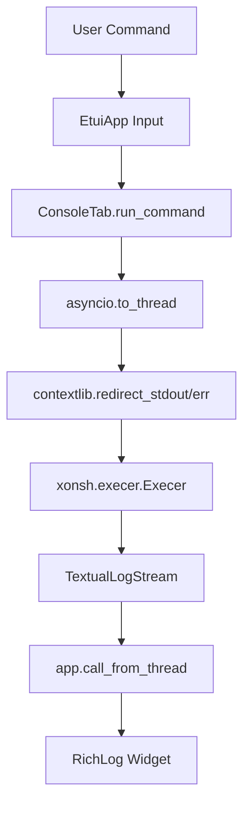

# xonsh Shell Integration in Console Tab

This document details how the Python-powered **xonsh** shell is embedded directly within the `ConsoleTab` of the `etui` application.

---

## 1. Execution Architecture

Instead of executing commands in individual, isolated subprocess shells (which throws away session state), `etui` embeds a persistent, in-process xonsh engine. 



### 1.1 Programmatic Initialization
Upon mounting the `ConsoleTab`, the xonsh environment is initialized using its Python API:
*   `xonsh.main.setup()` initializes the global session, default aliases, and configurations.
*   `XSH.env['XONSH_CAPTURE_ALWAYS'] = True` is set to ensure that all subprocess commands (e.g., standard shell commands like `ls` or `git`) have their stdout/stderr streams intercepted by xonsh and routed through Python's standard `sys.stdout` and `sys.stderr` streams.
*   A persistent globals dictionary (`ctx`) is maintained across all executed commands to preserve variables, functions, and state.

### 1.2 Thread-Safe Execution
To prevent long-running commands (e.g., `sleep 5` or large compiles) from freezing the TUI rendering loop, execution is offloaded to a background thread using Python's `asyncio.to_thread`:
```python
await asyncio.to_thread(self.execer.exec, command, glbs=self.ctx, locs=self.ctx)
```

---

## 2. Real-time Output Streaming (`TextualLogStream`)

Because standard output redirection in Python (like `contextlib.redirect_stdout`) only intercepts writes to the `sys.stdout` object and not the OS file descriptor `1`, standard subprocess outputs would normally print to the terminal screen behind the TUI.

To solve this, `etui` implements a custom, thread-safe, line-buffered stream decorator called `TextualLogStream`:

*   **Subprocess Capturing:** Enabling `$XONSH_CAPTURE_ALWAYS` forces xonsh to capture subprocess outputs and write them to Python's `sys.stdout`/`sys.stderr`.
*   **Real-time Output:** As xonsh streams chunks to the standard streams, `TextualLogStream.write()` buffers the incoming data.
*   **Line-Buffering:** When a newline (`\n`) is parsed, the buffer splits and writes complete lines immediately to the Textual log widget.
*   **Thread Safety:** Because execution happens in a background thread, the stream uses `self.app.call_from_thread(self.log_widget.write, line)` to coordinate safe UI updates on the main event loop.

---

## 3. Persistent Session State

Because the shell is run in-process using the same persistent globals/locals context dictionary, users have a hybrid Python/Shell REPL:

*   **Python Variables:** Creating variables (`x = 42`) or importing modules (`import math`) persists across submissions.
*   **Environment Variables:** Setting environment variables (`$MY_VAR = 'hello'`) updates the xonsh context.
*   **Directory Navigation:** Running `cd <path>` changes the current working directory. Because it is in-process, it also updates `os.getcwd()` globally, allowing the rest of the application (like the File browser) to align with the active directory path.

---

## 4. Packaging with PyInstaller

Because xonsh uses dynamic lazy-loading imports for its commands, history backends, and syntax lexers, PyInstaller cannot determine its dependency graph statically.

To solve this, the PyInstaller specification ([etui.spec](file:///home/pawel/src/32bitmicroLLC/EmbeddedTUI/etui/etui.spec)) uses `collect_submodules` to force bundling of all xonsh sub-packages:

```python
from PyInstaller.utils.hooks import collect_submodules
hiddenimports += collect_submodules('xonsh')
```
This ensures that the final packaged standalone binary for Linux, macOS, and Windows includes the complete xonsh shell engine.
