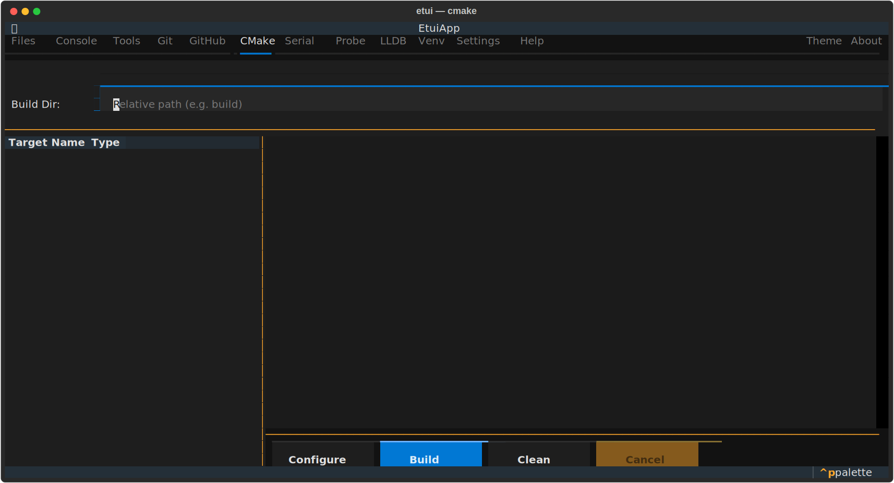

# CMake Tab

Configure and build CMake projects without leaving the terminal.

## Layout

| Area | Description |
|------|-------------|
| Header bar | Source directory (read-only), Build directory, Build type inputs |
| Left pane (30%) | Target list populated by CMake File API |
| Right pane (70%) | Real-time build log |
| Control bar | **Configure**, **Build**, **Clean**, **Cancel** buttons |

## Usage

1. Open a workspace that contains a `CMakeLists.txt` at its root — the source directory is filled automatically.
2. Set **Build directory** (default: `build`) and **Build type** (`Debug`, `Release`, `RelWithDebInfo`, `MinSizeRel`).
3. Click **Configure** to run `cmake -S … -B …` and populate the target list.
4. Select a target from the list (default: `all`).
5. Click **Build** to compile. Click **Cancel** at any time to terminate the build.
6. Click **Clean** to run `cmake --build … --target clean`.

## Notes

- Build type and directory must not change between **Configure** and **Build**. If they do, you must re-configure.
- The build directory must be a subdirectory of the source root.
- CMake File API is used to enumerate targets; a `cmake-configure` step is required before targets are listed.
- Multi-config generators (Ninja Multi-Config, Xcode) are supported.
