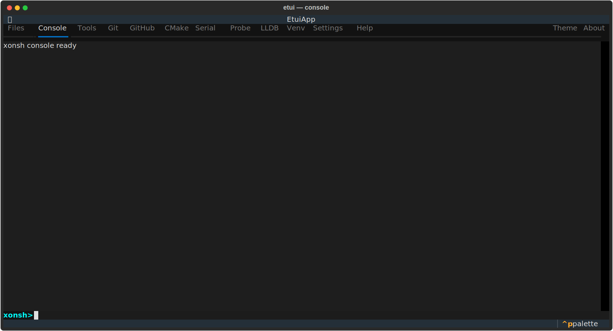

# Console Tab

An interactive shell powered by [xonsh](https://xonsh.org), running inside the workspace directory.

## Layout

| Area | Description |
|------|-------------|
| Log area | Scrolling command output |
| Input line | `>>>` prompt with a command input field |

## Usage

Type any shell command at the `>>>` prompt and press **Enter**.

- Standard shell commands work (`ls`, `cat`, `grep`, …).
- Python expressions work inline (`print(2 + 2)`).
- The working directory follows the workspace root set in Files or Settings.

## Notes

- Each command runs in an isolated xonsh subprocess; environment state is not shared between commands.
- The console starts in the workspace root. `cd` in one command does not persist to the next.
- Output is highlighted and supports ANSI color codes.
