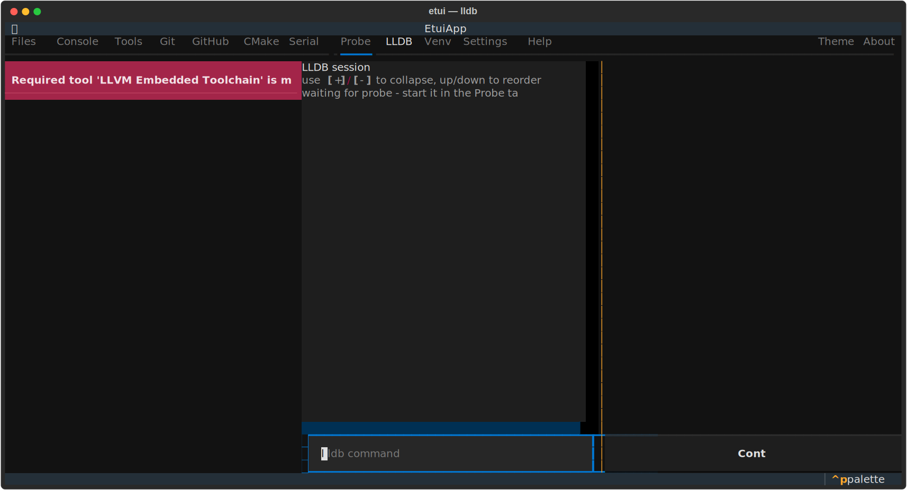

# LLDB Tab

An integrated LLDB debugger dashboard showing registers, assembly, stack, and backtrace panels in the terminal.

## Layout

| Area | Description |
|------|-------------|
| Dashboard panels | Configurable sections: Registers, Assembly, Stack, Backtrace, Source, Locals |
| LLDB console | Interactive LLDB command input and output |
| Control bar | **Connect**, **Step**, **Next**, **Continue**, **Stop** buttons |

## Dashboard Sections

| Section | Contents |
|---------|---------|
| **Registers** | CPU register values; changed registers highlighted |
| **Assembly** | Disassembly around the current PC, with current instruction highlighted |
| **Stack** | Raw stack memory words around `$sp` |
| **Backtrace** | Call stack frames |
| **Source** | Source lines around the current location |
| **Locals** | Local variable values for the current frame |

## Usage

1. Start the GDB server in the **Probe** tab. etui opens this tab automatically and connects.
2. Use LLDB commands in the console (e.g. `breakpoint set -n main`, `run`).
3. Use the control buttons or LLDB commands (`s`, `n`, `c`) to step through code.
4. The dashboard refreshes automatically at every stop.

## Configuration

- **Layout** — order and selection of dashboard sections. Set via `Settings → LLDB Dashboard` or directly by editing `~/.config/etui/settings.yaml`.
- **Theme** — color scheme. Change in **Settings → LLDB Dashboard** or the **Theme** tab. Available themes: vibrant, ocean, monochrome, solarized, dracula.

## Notes

- The dashboard panels are driven by a stop-hook that runs LLDB commands after each stop event. Output is streamed over the same terminal as the LLDB session.
- Changed register values are highlighted in the Registers panel compared to the previous stop.
