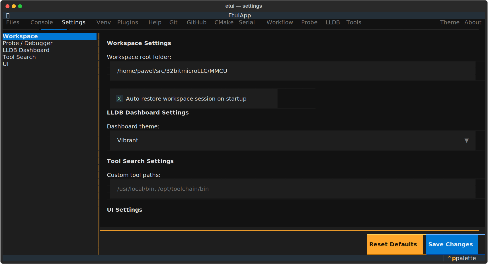

# Settings Tab

Centralized configuration for etui and its integrations. Settings are stored in `~/.config/etui/settings.yaml` and applied at runtime without restarting.

## Layout

| Area | Description |
|------|-------------|
| Sidebar (left) | Category list: Workspace, Probe / Debugger, LLDB Dashboard, Tool Paths, UI |
| Form area (right) | Settings fields for the selected category |
| Button bar | **Reset Defaults**, **Save Changes** |

## Categories

### Workspace

| Setting | Description |
|---------|-------------|
| Workspace root folder | Default directory opened in Files, Git, CMake, and Console |
| Auto-restore on startup | Reopen the last workspace when etui starts |

### Probe / Debugger

| Setting | Description |
|---------|-------------|
| Debugger backend | `pyocd`, `openocd`, or `gdb` |
| Target family | e.g. `MSPM0L` |
| Adapter speed (kHz) | SWD/JTAG clock speed |
| GDB server port | Default: 3333 |
| Telnet port | Default: 4444 |
| TCL port | Default: 6666 |

### LLDB Dashboard

| Setting | Description |
|---------|-------------|
| Dashboard visual theme | Color scheme: vibrant, ocean, monochrome, solarized, dracula |

### Tool Paths

| Setting | Description |
|---------|-------------|
| Custom search paths | Additional directories searched for tool executables, comma- or newline-separated |

### UI

| Setting | Description |
|---------|-------------|
| Word wrap in log views | Enable soft word wrapping in all RichLog widgets |

## Usage

1. Select a category in the sidebar.
2. Edit the fields.
3. Click **Save Changes** to persist and apply immediately.
4. Click **Reset Defaults** to restore factory values in the form (does not save until you click **Save Changes**).

## Storage

Settings are stored in `~/.config/etui/settings.yaml`. Existing legacy JSON configs (`workspace.json`, `debugger.json`, `dashboard.json`, `tools.json`) are migrated automatically on first run.
